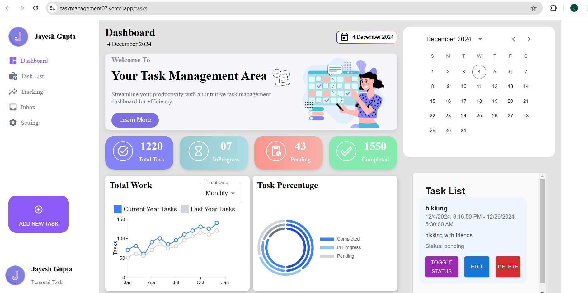
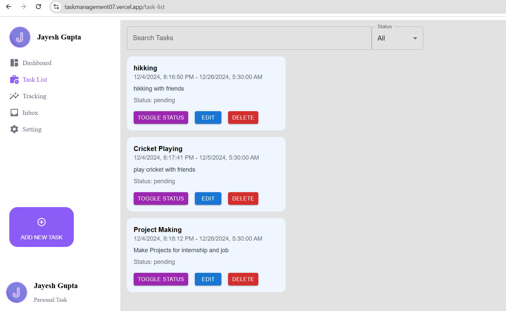

# Task Management App 📋✅

This is a powerful and user-friendly task management app designed to help you organize, track, and manage tasks efficiently. It leverages modern technologies and libraries to provide a seamless experience.

## 🛠️ Features

- **Task Management**: Add, edit, delete, and filter tasks.
- **Status Tracking**: Track tasks by their status (Pending, In Process, Completed).
- **Overdue Highlighting**: Easily identify overdue tasks.
- **Search Functionality**: Search for tasks by their title.
- **Filters**: Filter tasks by status or view all overdue tasks.
- **Edit Modal**: Update task details using a clean and simple modal.
- **Theming and Design**: Beautiful UI built using Material-UI (MUI).
- **Analytics and Charts**: Visualize task data with chart integrations.

## 🚀 Getting Started

### Prerequisites

- [Node.js](https://nodejs.org/) (v16+ recommended)
- [npm](https://www.npmjs.com/) (or yarn)

### Installation

1. Clone the repository:
   ```
   git clone https://github.com/yourusername/task-management-app.git
   ```

2. Install dependencies:
   ```
   npm install
   ```

3. Start the development server:
   ```
   npm run dev
   ```

4. Open your browser and navigate to http://localhost:5173.

## 🛠️ Tech Stack

- **Frontend**: React.js, Redux Toolkit, Material-UI, React Router DOM, Styled Components
- **Data Visualization**: Chart.js, Recharts
- **Task Management**: Syncfusion Gantt Chart
- **Build Tool**: Vite

## 🎨 UI Preview

| Dashboard View | Task List View |
|---------------|----------------|
|  |  |

## 🔍 How It Works

1. **Dashboard**: View a summary of tasks by status and analyze task completion trends with charts.
2. **Task List**: Add, filter, search, edit, and delete tasks.
3. **Overdue Tasks**: Overdue tasks are highlighted in red for quick identification.

## 📜 Scripts

| Script | Command | Description |
|--------|---------|-------------|
| dev | `npm run dev` | Starts the development server using Vite |
| build | `npm run build` | Builds the project for production |
| preview | `npm run preview` | Previews the production build |
| lint | `npm run lint` | Runs ESLint to enforce coding standards |

## 📝 Validation Rules

- Task titles are required for new or edited tasks.
- Overdue tasks are automatically highlighted.

## 🤝 Contributing

We welcome contributions to improve the Task Management App. Here's how you can help:

1. Fork the repository.
2. Create a new branch (`feature/my-feature`).
3. Commit your changes and push them to your branch.
4. Open a pull request for review.

## 🌟 Acknowledgments

This app is powered by an amazing ecosystem of libraries and tools, including:
- Material-UI
- Redux Toolkit
- Chart.js
- Recharts
- Syncfusion Gantt Chart

## 📞 Support

If you encounter any issues or have suggestions, please feel free to open an issue.

Enjoy using the Task Management App to boost your productivity! 🚀✨